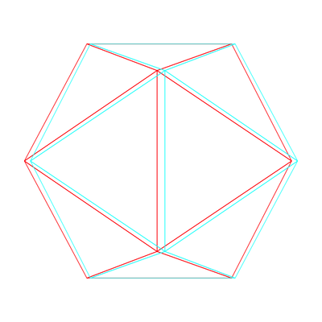

<!-- README.md is generated from README.Rmd. Please edit that file -->

```{r setup, include = FALSE}
suppressPackageStartupMessages({
  library(dplyr)
  library(ggplot2)
  library(threed)
  library(ggthreed)
  library(threed)
})

knitr::opts_chunk$set(
  collapse = TRUE,
  comment = "#>",
  fig.path = "man/figures/README-",
  out.width = "100%"
)
```

# ggthreed - 3d geoms and stats for ggplot2

[](https://travis-ci.org/coolbutuseless/ggthreed)
[](https://ci.appveyor.com/project/coolbutuseless/ggthreed)


[`ggthreed`](https://github.com/coolbutuseless/ggthreed) is a collection of [`ggplot2`](https://github.com/tidyverse/ggplot2) 
geoms which use the [`threed`](https://github.com/coolbutuseless/threed) library.

What's in the box:

* `geom_threedpie()` for creating 3d pie charts.
    * **I am fully aware of the crimes against visualisation I am committing here.**
* `stat_anaglyph()` for creating red-blue anaglyph images


## Installation

You can install from github

```{r eval=FALSE}
# install.packages("devtools")
devtools::install_github("coolbutuseless/threed")
devtools::install_github("coolbutuseless/ggthreed")
```


# Red/blue anaglyphs with `stat_anaglyph()`

**Grab your glasses and lower your expectations!!**


## Usage

* Works with point, line and polygon geoms.  Although "works" may be a strong term - 
   the 3d effect is very weak even if you tweak all the parameters
* It might work with other geoms, but no guarantees that it produces anything 
worth looking at.
* parameters:
    * `zoffset`, `zscale` - for determining how `z` aesthetic influences position
    * `red`, `blue` - hex colours to use for red/blue
    * `switch` - switch position of the colours

## Example red/blue anaglyphs with points.


```{r}
ggplot(mtcars) +
  geom_point(aes(mpg, y = wt, z = disp), stat = 'anaglyph', alpha = 0.5, zscale = 10) +
  theme_bw()
```


### Example of combined 3d projection and anaglyph

```{r gallery-cube}
library(threed)

camera_to_world <- look_at_matrix(eye = c(1.5, 1.75, 3), at = c(0, 0, 0))

obj <- threed::mesh3dobj$cube %>%
  transform_by(invert_matrix(camera_to_world)) %>%
  translate_by(c(0, 0, -3)) %>%
  perspective_projection()

ggplot(obj, aes(x, y, z = z, group = element_id)) +
  geom_polygon(fill = NA, colour='black', aes(size = hidden), stat = 'anaglyph',
               zscale = 0.05, zoffset = -1.4, zinvert = FALSE) +
  scale_linetype_manual(values = c('TRUE' = "FF", 'FALSE' = 'solid')) +
  scale_size_manual(values = c('TRUE' = 0.1, 'FALSE' = 0.5)) +
  theme_void() +
  theme(legend.position = 'none') +
  coord_equal()
```


## Animated Anaglyph

### Animated Icosahedron

See `vignette('animated-anaglyph', package='ggthreed')`




# 3d pie charts with `geom_threedpie()`

## Usage

* Requires only an `x` variable - which must be discrete.
* Default stat is `count`
* Adjustable parameters:
    * camera position
    * pie height
    * starting angle for first pie slice
    * tilt angle of pie relative to camera


## Issues/Limitations

* `geom_threedpie()` overrides the aspect ratio of the plot it is displaying. 
  This is a gigantic hack!  It means it is not possible to use `coord_fixed()` etc 
  to change the plot aspec ratio.
* The initial panel grid and x- and y-axes are still generated by the geom. Currently
  the only way to turn this off it to use `theme_void()`. Not sure how to disable
  this from within the `geom`.
* Pie slice resolution is in increments of 2 degrees.


## Example - Simple Pie Chart

```{r example-simple, out.width=500, fig.width = 6, fig.height = 4}
ggplot(mtcars) + 
  geom_threedpie(aes(x = as.factor(cyl))) + 
  theme_void() + 
  theme(legend.position = 'bottom')
```


## Example - Facetted Pie Chart
```{r example-facet}
ggplot(diamonds)  +
  geom_threedpie(aes(as.factor(cut))) +
  facet_wrap(~clarity, labeller = label_both) +
  labs(title = "Distribution of Diamond Cuts by Clarity") +
  scale_fill_brewer(name = "Cut", palette = 'Set2') +
  theme_void()
```


## Example - Behind the Scenes

* This plot shows the polygons making up the pie.
* Triangular polygons are rendered on top, and quadrilaterals are 
  rendered for the side.
* The `threed` library is used to rotate the assembled polygons and perform
  perspective projection.
* By plotting the polygons in order of distance from the camera (furtherest polygons first), 
  polygons which are behind others are hidden from view.
* The pie has no bottom.
* The quadrilaterals making up the side are the same colour as the top, but darkened by 15%.

```{r example-behind}
ggplot(mtcars) + 
  geom_threedpie(aes(x = as.factor(cyl)), alpha = 0.5) + 
  theme_void() + 
  theme(legend.position = 'bottom')
```


## Example - Pie configuration

User adjustable:

* pie height
* pie tilt
* start of first pie slice


```{r example-animation, eval = FALSE, echo = FALSE}
N <- 20
start_degrees <- seq(  0, 90 , length.out = N)
tilt_degrees  <- seq(  -20, 50 , length.out = N)
heights       <- seq(0.1, 0.1, length.out = N)

start_degrees <- c(start_degrees, rev(start_degrees))
tilt_degrees  <- c(tilt_degrees , rev(tilt_degrees ))
heights       <- c(heights      , rev(heights      ))

for (i in seq_along(start_degrees)) {
  
  p <- ggplot(mtcars) + 
    geom_threedpie(aes(x = as.factor(cyl)), start_degrees = start_degrees[i],
                   tilt_degrees = tilt_degrees[i], height = heights[i]) + 
    theme_void() + 
    theme(legend.position = 'bottom')

  filename <- sprintf("%03i.png", i)
  print(filename)
  ggsave(filename, plot=p, width=6, height=4)
    
}
```


