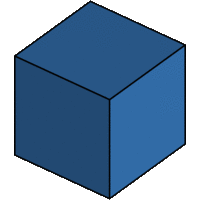
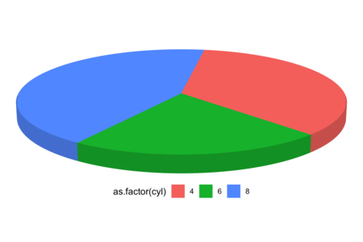

<!-- README.md is generated from README.Rmd. Please edit that file -->

# ggthreed - 3d geoms for ggplot2


[`ggthreed`](https://github.com/coolbutuseless/ggthreed) is a collection
of [`ggplot2`](https://github.com/tidyverse/ggplot2) geoms which use the
[`threed`](https://github.com/coolbutuseless/threed) library.

At present it consists of just a single geom: `geom_threedpie()` which
creates 3d pie charts.

**I am fully aware of the crimes against visualisation I am committing
here.**

## Installation

You can install from github

``` r
# install.packages("devtools")
devtools::install_github("coolbutuseless/threed")
devtools::install_github("coolbutuseless/ggthreed")
```

## Usage

  - Requires only an `x` variable - which must be discrete.
  - Default stat is `count`
  - Adjustable parameters:
      - camera position
      - pie height
      - starting angle for first pie slice
      - tilt angle of pie relative to camera

## Issues/Limitations

  - `geom_threedpie()` overrides the aspect ratio of the plot it is
    displaying. This is a gigantic hack\! It means it is not possible to
    use `coord_fixed()` etc to change the plot aspec ratio.
  - The initial panel grid and x- and y-axes are still generated by the
    geom. Currently the only way to turn this off it to use
    `theme_void()`. Not sure how to disable this from within the `geom`.
  - Pie slice resolution is in increments of 2 degrees.

# Example - Simple Pie Chart

``` r
ggplot(mtcars) + 
  geom_threedpie(aes(x = as.factor(cyl))) + 
  theme_void() + 
  theme(legend.position = 'bottom')
```


# Example - Facetted Pie Chart

``` r
ggplot(diamonds)  +
  geom_threedpie(aes(as.factor(cut))) +
  facet_wrap(~clarity, labeller = label_both) +
  labs(title = "Distribution of Diamond Cuts by Clarity") +
  scale_fill_brewer(name = "Cut", palette = 'Set2') +
  theme_void()
```


# Example - Behind the Scenes

  - This plot shows the polygons making up the pie.
  - Triangular polygons are rendered on top, and quadrilaterals are
    rendered for the side.
  - The `threed` library is used to rotate the assembled polygons and
    perform perspective projection.
  - By plotting the polygons in order of distance from the camera
    (furtherest polygons first), polygons which are behind others are
    hidden from view.
  - The pie has no bottom.
  - The quadrilaterals making up the side are the same colour as the
    top, but darkened by 15%.

<!-- end list -->

``` r
ggplot(mtcars) + 
  geom_threedpie(aes(x = as.factor(cyl)), alpha = 0.5) + 
  theme_void() + 
  theme(legend.position = 'bottom')
```


# Example - Pie configuration

User adjustable:

  - pie height
  - pie tilt
  - start of first pie slice


